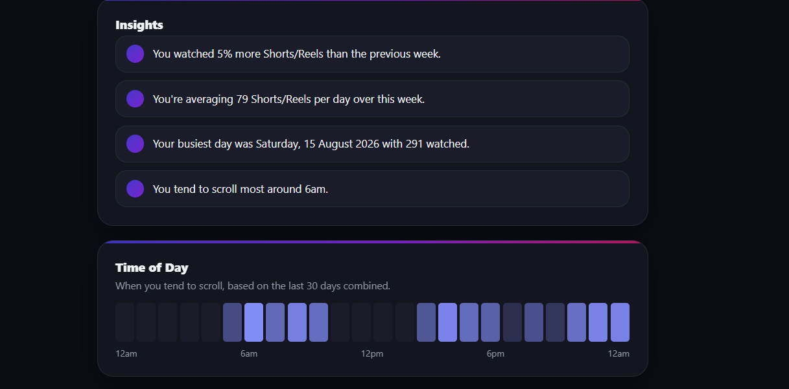

# Scroll Tracker

A browser extension that helps you track how much time and attention you spend watching YouTube Shorts and Instagram Reels.

## Overview

Scroll Tracker is built for people who want more awareness around their short-form video habits. It counts the number of Shorts and Reels you watch each day and gives you a simple dashboard to review your usage.

## Why this project

Short-form video platforms are designed to keep you scrolling. This extension gives you a small amount of visibility into your behavior so you can become more intentional with your time.

## Features

- Tracks daily YouTube Shorts and Instagram Reels activity
- Stores usage data locally in the browser
- Shows total counts in a dashboard
- Helps spot daily trends and movement over time
- Easy to load as an unpacked browser extension

## Screenshots

### Dashboard view

### Usage tracking view

## Installation

1. Clone or download this repository.
2. Open Chrome or Edge.
3. Go to `chrome://extensions` or `edge://extensions`.
4. Enable Developer mode.
5. Click Load unpacked.
6. Select this project folder.

## Project structure

- `manifest.json` – extension metadata and permissions
- `background.js` – service worker logic
- `content.js` – page monitoring for supported sites
- `popup.html` and `popup.js` – popup UI
- `dashboard.html` and `dashboard.js` – usage dashboard
- `utils.js` – shared helper logic
- `icons/` – app icon and screenshots

## Privacy

This project stores usage information locally in the browser. It does not require an account or external service to function.

## License

This project is provided for personal, educational, and experimental use.
